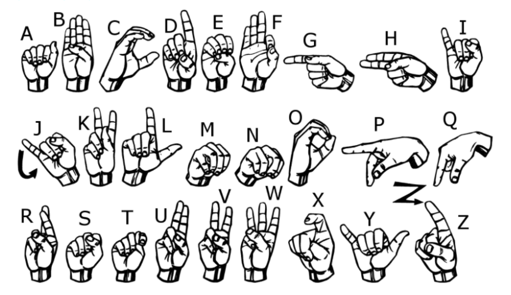

# Sign Language Recognition Project

## About the project

Bu proje, derin öğrenme ve görüntü işleme tekniklerini kullanarak işaret dili tanımayı amaçlayan bir yapay zeka projesidir. Amacı, işaret dili kullanıcılarının işaretlerini gerçek zamanlı olarak tanıyarak, dil engeli olan kişilerin iletişimini kolaylaştırmaktır.

Projede, Amerikan işaret dili kullanılarak 26 farklı işaret sınıfını tanımak için bir derin öğrenme modeli kullanılmıştır. Model, CNN (Convolutional Neural Network) mimarisi kullanılarak tasarlanmış ve TensorFlow ve Keras kütüphaneleriyle Python programlama dili üzerinde geliştirilmiştir. Eğitim için büyük bir işaret dili veri kümesi kullanılmış ve veriler önceden işlenmiş ve normalize edilmiştir.

## Code Content

Kod, Amerikan İşaret Dili (ASL) alfabesini tanımak için derin öğrenme modeli oluşturur ve daha sonrasında eğitmektedir. İşaret dili veri seti olan "sign_mnist_train" ve "sign_mnist_test" veri kümelerini kullanır.

İlk olarak, gerekli kütüphaneleri yükler ve veri setini okur. Veri seti, görüntülerin piksel değerlerini içeren bir CSV dosyasıdır.

Daha sonra, veriyi ön işleme adımlarından geçirir. Verileri normalize eder, görüntü boyutlarını yeniden şekillendirir ve etiketleri hazırlar.

Sonra, bir Convolutional Neural Network (CNN) modeli oluşturur. CNN, evrişimli katmanlar ve tam bağlantılı katmanlardan oluşur. Modeli derler ve eğitir.

Son olarak, modeli kaydeder ve bir görüntü üzerinde tahmin yapar.

Bu kodda eğitim yapılabilmesi adına Logistic Regression modeli kullanılmıştır. 

## Benefits of the Project

- İşaret dili tanıma, işitme engelli bireylerin iletişimini kolaylaştırır ve onlara daha bağımsız bir yaşam sağlar.
- Gerçek zamanlı işaret dili tanıma, iletişimde hız ve doğruluk sağlar, böylece iletişim engellerini azaltır.
- Derin öğrenme ve görüntü işleme tekniklerinin kullanılması, daha yüksek tanıma doğruluğu ve performansı sağlar.
- İşaret dili tanıma, toplumda işitme engellilere yönelik farkındalığı artırır ve daha kapsayıcı bir toplum oluşturur.

## Use of the Project

1. **Veri Toplama ve Ön İşleme**: İşaret dili veri seti toplanır ve işlenir. Veriler normalize edilir, boyutları yeniden şekillendirilir ve sınıflara ayrılır.

2. **Model Eğitimi**: Derin öğrenme modeli, eğitim veri seti üzerinde eğitilir. Modelin içerisinde evrişimli katmanlar, tam bağlantılı katmanlar ve sınıflandırma katmanı bulunur.

3. **Model Optimizasyonu**: Modelin performansı optimize edilir, hiperparametreler ayarlanır ve overfitting'i önlemek için yöntemler kullanılır.

4. **Gerçek Zamanlı Tanıma**: Eğitilmiş model, gerçek zamanlı olarak işaret dili girdilerini alır ve sınıflandırma yapar. Sonuçlar kullanıcıya anlamlı bir şekilde gösterilir.

## How Can I Contribute?

Bu projeye katkıda bulunmak isterseniz, aşağıdaki adımları takip edebilirsiniz:

1. Projenin GitHub deposunu çatallayın (fork) ve yerel bir kopyasını oluşturun.
2. Yeni bir özellik eklemek, hata düzeltmek veya mevcut kodu iyileştirmek için değişiklikler yapın.
3. Değişikliklerinizi bir dal (branch) oluşturarak yapın ve bu dal üzerinde çalışın.
4. Değişikliklerinizi commit edin ve GitHub deposuna gönderin (push).
5. Bir pull talebi (pull request) oluşturarak değişikliklerinizi ana projeye entegre etmek için başvuruda bulunun.
